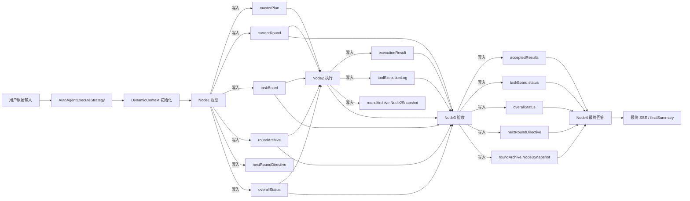

# Auto Agent Harness 数据流说明

本文档描述当前项目里 Auto Agent 的真实运行方式，重点是：
- 每个节点从哪里拿输入
- 每个节点把什么写回 `DynamicContext`
- 哪些信息属于运行时装配层，哪些信息属于业务状态层
- 前端展示和后端 SSE 事件如何对齐

## 1. 总体结构

当前系统不是“一个模型一次性回答”，而是一个固定环形的多节点 harness：

控制流固定为：
- `Node1 -> Node2 -> Node3 -> Node1 ... -> Node4`

其中：
- `Node1` 是规划和派工
- `Node2` 是执行
- `Node3` 是验收和下一轮建议
- `Node4` 是最终交付

## 2. 两层状态

### 2.1 运行时装配层

这层不属于节点间业务流转，而是 Spring AI / MCP / Advisor 的运行时能力：

- `ChatClient`
- MCP 工具客户端
- `advisor`
- RAG / memory
- token 统计
- SSE emitter

这部分在代码里由装配链和 advisor 机制注入，不应该当作业务字段写进 prompt 真正的状态契约里。

### 2.2 业务状态层

这层由 `DynamicContext` 承载，是真正节点之间交换的状态：

- `sessionGoal`
- `masterPlan`
- `currentRound`
- `taskBoard`
- `roundArchive`
- `toolExecutionLog`
- `acceptedResults`
- `overallStatus`
- `nextRoundDirective`

这些对象是 harness 的真相来源。

## 3. DynamicContext 里到底有什么

### 3.1 `sessionGoal`

作用：
- 保存用户原始问题和归一化目标

典型字段：
- `rawUserInput`
- `sanitizedGoal`
- `successCriteria`
- `maxRounds`
- `failurePolicy`

谁写：
- 启动初始化阶段写入

谁读：
- `Node1`
- `Node2`
- `Node3`
- `Node4`

### 3.2 `masterPlan`

作用：
- 保存多轮任务的主步骤列表

典型字段：
- `planVersion`
- `mainSteps[]`
- `sessionGoal`

每个主步骤通常包含：
- `stepId`
- `title`
- `goal`
- `completionCriteria`
- `status`
- `dependencies[]`

谁写：
- `Node1`

谁读：
- `Node1`
- `Node3`
- `Node4`

### 3.3 `currentRound`

作用：
- 保存当前这一轮的唯一执行视图

典型字段：
- `roundIndex`
- `currentStepId`
- `roundTask`
- `suggestedTools[]`
- `plannerNotes`
- `expectedEvidence`
- `toolRequired`

谁写：
- `Node1`

谁读：
- `Node2`
- `Node3`
- `Node4`

### 3.4 `taskBoard`

作用：
- 以 step 为粒度记录状态

典型字段：
- `stepId`
- `status`
- `attemptCount`
- `lastRoundTask`
- `lastFailureReason`
- `acceptedOutputs[]`

谁写：
- `Node1`
- `Node3`

谁读：
- `Node1`
- `Node3`
- `Node4`

### 3.5 `roundArchive`

作用：
- 以轮次为粒度归档

每轮通常保存：
- Node1 的规划快照
- Node2 的执行快照
- Node3 的验收快照

谁写：
- `Node1`
- `Node2`
- `Node3`

谁读：
- `Node1`
- `Node3`
- `Node4`

### 3.6 `toolExecutionLog`

作用：
- 记录真实工具调用痕迹，不是模型口头总结

典型字段：
- `roundIndex`
- `stepId`
- `toolName`
- `requestPayload`
- `responsePayload`
- `success`
- `errorMessage`
- `timestamp`

谁写：
- `Node2`

谁读：
- `Node3`
- `Node4`

### 3.7 `acceptedResults`

作用：
- 只保存 Node3 验收通过的结果摘要

典型字段：
- `stepId`
- `resultType`
- `content`
- `evidenceRefs`
- `acceptedByRound`
- `acceptedReason`

谁写：
- `Node3`

谁读：
- `Node4`
- `Node1`

### 3.8 `overallStatus`

作用：
- 保存整体流程状态

典型字段：
- `state`
- `completedSteps`
- `remainingSteps`
- `blockedReasons`
- `finalDecision`

谁写：
- `Node1`
- `Node3`

谁读：
- `Node1`
- `Node3`
- `Node4`

### 3.9 `nextRoundDirective`

作用：
- 保存 Node3 对下一轮的建议

典型字段：
- `directiveType`
- `targetStepId`
- `reason`

常见值：
- `REPLAN_SAME_STEP`
- `ADVANCE_NEXT_STEP`
- `FINISH_SUCCESS`
- `FINISH_PARTIAL`
- `FINISH_FAILED`

谁写：
- `Node3`

谁读：
- `Node1`
- `Node4`

## 4. 每个节点实际读写什么

### 4.1 Node1

读：
- `rawUserInput`
- `sessionGoal`
- `currentRound`
- `masterPlan`
- `taskBoard`
- `roundArchive`
- `nextRoundDirective`
- `overallStatus`
- `availableTools`
- `advisorSummary`

写：
- `masterPlan`
- `currentRound`
- `taskBoard`
- `roundArchive`
- `nextRoundDirective`
- `overallStatus`

本质职责：
- 理解总目标
- 拆主步骤
- 生成当前轮任务
- 决定 Node2 本轮做什么

### 4.2 Node2

读：
- `currentRound`
- `rawUserInput`
- `advisorSummary`
- `availableTools`
- `compatPlan`（只做兼容）

写：
- `executionResult`
- `lastToolError`
- `toolExecutionLog`
- `roundArchive.Node2Snapshot`

本质职责：
- 执行当前轮
- 决定是否用 MCP
- 产出可验收证据

### 4.3 Node3

读：
- `currentRound`
- `executionOutcome`
- `taskBoard`
- `acceptedResults`
- `overallStatus`
- `roundArchive`
- `rawUserInput`
- `verificationPolicy`

写：
- `acceptedResults`
- `taskBoard`
- `overallStatus`
- `nextRoundDirective`
- `roundArchive.Node3Snapshot`

本质职责：
- 验证本轮是否通过
- 验证总任务是否通过
- 决定下一轮如何回到 Node1

### 4.4 Node4

读：
- `rawUserInput`
- `sanitizedGoal`
- `acceptedResults`
- `taskBoard`
- `roundArchive`
- `overallStatus`
- `nextRoundDirective`
- `answerPolicy`

写：
- `finalSummary`

本质职责：
- 组织最终用户回答
- 只基于验收结果交付
- 不再重算事实

## 5. Prompt 和 runtime 注入怎么配合

### 5.1 Prompt 负责什么

Prompt 负责告诉模型：
- 它是谁
- 它看哪些字段
- 它输出什么格式
- 它的边界是什么

### 5.2 Runtime 负责什么

Runtime 负责：
- 把对应字段塞进 prompt
- 把 advisor / RAG / memory 挂到 ChatClient 上
- 把工具客户端挂到 ChatClient 上
- 把 token、SSE、日志、回执写入上下文

### 5.3 不应该做的事

不应该把所有 `DynamicContext` 字段无差别塞进 prompt。  
这会让模型混淆：
- 哪些是事实
- 哪些是兼容字段
- 哪些是运行时对象
- 哪些是历史痕迹

现在的正确方式是：
- 业务状态存在 `DynamicContext`
- 每个节点只序列化自己需要的字段
- advisor / RAG / memory 通过运行时装配注入

## 6. 前端和 SSE 的对齐

当前前端已经按下面的事件逻辑展示：
- `analysis`
- `execution`
- `supervision`
- `summary`
- `error`
- `token`

前端处理方式：
- 左侧展示思考流
- 右侧只展示最终 `summary`
- `thinkingNav` 按问题/轮次/节点做导航
- `timestamp` 会显示在左右两边

因此当前前端和后端的核心契约是匹配的：
- Node1 对应 `analysis`
- Node2 对应 `execution`
- Node3 对应 `supervision`
- Node4 对应 `summary`

## 7. 现在这套结构是否完整

结论：
- 主链路是完整的
- 字段流转是明确的
- Prompt 和代码的主契约是对齐的
- 前端展示也和 SSE 事件契约对齐

但还保留少量兼容债：
- `currentStepPlan`
- `executionHistory`
- `compatPlan`
- 一些 legacy 解析逻辑

这些不会破坏主链路，但说明系统还没有完全切到“纯 currentRound 语义”的最终版。

## 8. 运行建议

如果你只想先跑起来，当前需要做的是：
1. 把 `Prompt.txt` 里的 SQL 执行到 MySQL，覆盖 `6101~6104`
2. 重启后端服务，确保新的 prompt 被重新装配
3. 刷新前端页面，前端代码本身不需要额外改动

如果你还想要更强的一致性，下一步可以继续清理：
- `Node2` 的兼容链
- `Node3` 的 legacy 解析兜底
- 兼容字段在 `DynamicContext` 里的历史残留
